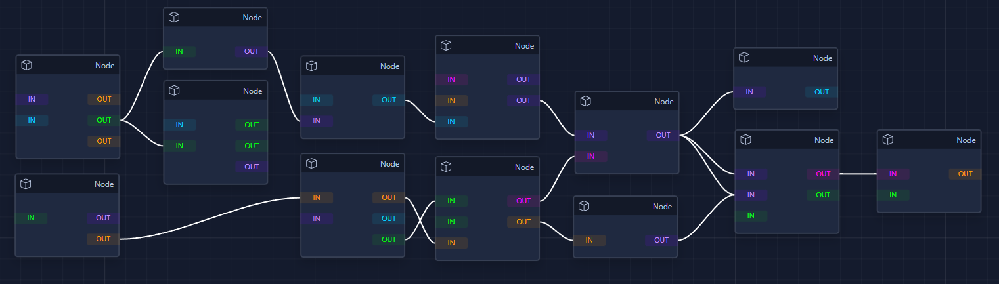

# MXFlow
This project is a proof-of-concept node-graph editor written in vanilla TypeScript. This is really just a showcase and is not intended, or sufficient, for production use. This project was written with component framework integration in mind.



[Demo](https://jhavrick.github.io/mxflow/) \
[Basic Example](#example) \
[API Documentation](/api.md)

MXFlow currently supports the following features:
 - Custom Nodes, Edges, Links
 - Custom Drag Grid
 - Drag Handles
 - Automatic Node Layering
 - Select
 - Multi-Select
 - Lasso Select
 - Pan / Zoom
 - Undo / Redo 
 - Custom Control Scheme
 - Context Menu
 - Link Validation
 - Model Hydration
 - Custom Background
 - Portal Rendering (for Vue, React, Svelte, etc.)

Touch screen support is basically non-existent and there are a number of other partial or poorly-implemented features such as the ability to focus a specific node or automatically arrange nodes.

Of course, if you're looking for an actual solution there really isn't a better option out there than [react-flow](https://reactflow.dev/).

# Example

### Node Template

 First define a node template. This is just the "scaffolding" used for each node. Multiple templates can be used at once. The node's content is provided in a `render` method which is provided in the config.

```html
<div data-mxflow-node-template>
    <ul data-mxflow-edge-group="inputs" data-mxflow-edge-latch="left">
        <!-- Input edges dynamically populated -->
    </ul>
    <div data-mxflow-node-content>
        <!-- Node content provided during render -->
    </div>
    <ul data-mxflow-edge-group="outputs" data-mxflow-edge-latch="right">
        <!-- Output edges dynamically populated -->
    </ul>
</div>
```
The data attributes applied to each element tell MXFlow which area of the node is being scaffolded. This information is used internally to determine where certain elements are found. The available / necessary data attributes can be found on the `FlowAttr` enum.

### MXFlow Instance

Next we can define our instance with a minimal configuration object. See the `Options` type for complete list of documented options.

```typescript
let root = document.getElementById('root');
if (root){
    const mxflow = MXFlowController(root, {
        nodeHTMLTemplate: template, //As defined above
        /**
         * The width/height define the size of the graph, but the size of your root element determines the
         * size of the viewport.
         */ 
        width: 5000,
        height: 2500,
        /**
         * Describe the background pattern. Custom patterns can be provided through the API.
         */ 
        background: {
            type: 'grid',
            radius: 1.5,
            size: 32
        },
        /**
         * Define our min/max zoom as well as zoom step.
         */ 
        panzoom: {
            minScale: .25,
            scaleStep: .1
        },
        /**
         * Return whatever content you'd like to be in the context menu depending on
         * what graph element is targeted (node, edge, link, graph).
         */ 
        renderContext: (item, x, y) => {
            return `Target: ${item.type}`;
        },
        /**
         * Render the actual content for each node or edge. This content is cached, so unless a node's 
         * content needs to be re-rendered, you can simply return the existing content or a modified version. 
         * You can return an HTML string or an HTMLElement here.
         */ 
        render: (item, content, data) => {
            //We only need to generate content for un-rendered items
            if (content) return content; 
            switch (item.type){
                case 'node': //Return basic node content
                    return `
                        <div>
                            <div class="mxflow-node-header">
                                ${title}
                            </div>
                            <div class="mxflow-node-body" mx-content>
                                
                            </div>
                        </div>
                    `;
            }
        }
    });
}
```

### Adding a Node

Then we can programmatically add a node. It's usually a good idea to size your nodes in increments of the grid size. Note that when we add edges we must specify a grouping. These groups are defined in the node template and are not necessarily restricted to just inputs and outputs.

```typescript
mxflow.addNode('key', { 
    x: 100, 
    y: 100, 
    width: 160, 
    height: 96, 
    edges: [
        { group: 'inputs', key: `input-1` },
        { group: 'inputs', key: `input-2` },
        { group: 'outputs', key: `output-1` },
        { group: 'outputs', key: `output-2` }
    ]
})
```

<!-- # Previews

### Link Nodes
Nodes are linked by dragging from one edge to another. In this example, custom link validation is used to prevent incompatible edges from being connected.


### Lasso


### Undo
 -->